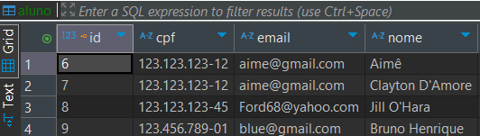
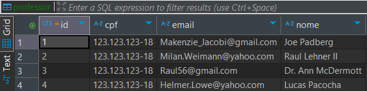
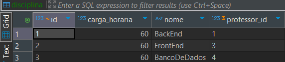
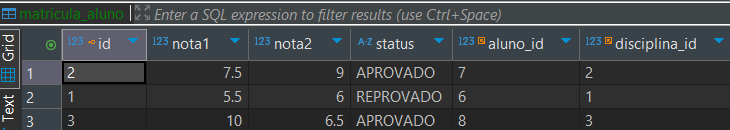
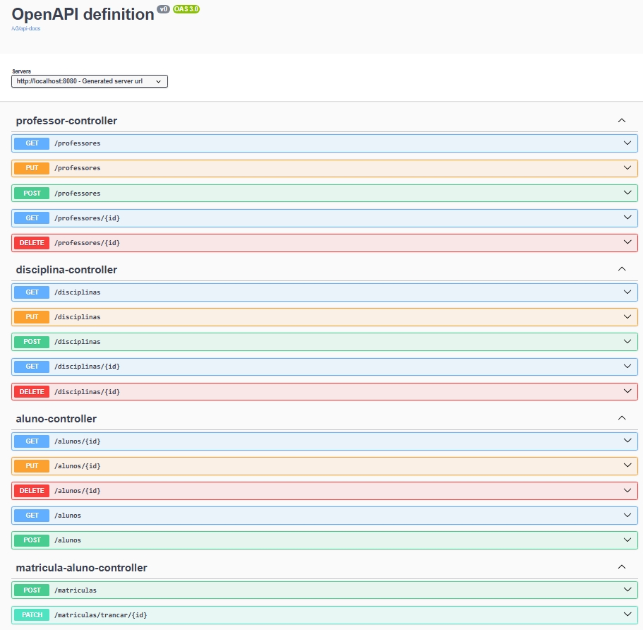

<h1 align="center">🎓 Aluno Online - Backend</h1>

<p align="center">
  Sistema de gerenciamento acadêmico desenvolvido com Java e Spring Boot.
</p>

---

## 📖 Sumário

- [📚 Sobre](#-sobre)
- [🚀 Tecnologias e Ferramentas](#-tecnologias-e-ferramentas)
- [🧪 Testes e Prints](#-testes-e-prints)
- [📘 Documentação Swagger](#-documentação-swagger)
- [👩‍💻 Autora](#-autora)

---

## 📚 Sobre

Olá! Me chamo **Manuela Aimê**, sou estudante de **Sistemas de Informação** e atualmente curso o **3º período**.

Este repositório faz parte do meu desenvolvimento na disciplina **Tecnologia para Back-end I**, ministrada pelo professor **Kelson Almeida**.  
O projeto tem como objetivo aplicar os conceitos de **APIs RESTful** para construir um sistema completo de gerenciamento acadêmico, com foco em:

- Cadastro e manutenção de **Alunos**
- Cadastro e manutenção de **Professores**
- Cadastro de **Disciplinas**
- Realização de **Matrículas**

---


## 🚀 Tecnologias e Ferramentas utilizadas


---


### ✅ Pré-requisitos

- Java 17
- PostgreSQL
- Maven

### 🧩 Clonando o projeto

```bash
git clone https://github.com/manuelaaime/Aluno-Online.git
cd Aluno-Online


## 🖼️ Prints

### 📬 Insomnia: Endpoints

> Testes realizados via Insomnia para simular requisições REST aos seguintes recursos:

- CRUD Aluno
![Captura de tela da requisição criarAluno]
(/src/assets/CriarAluno.png)

Captura de tela da requisição listarTodosAlunos 
![Captura de tela da requisição listarTodosAlunos]
(src/assets/ListarTodosAlunos.png)

Captura de tela da requisição buscarAlunoPorId
![Captura de tela da requisição buscarAlunoPorId]
(src/assetsBuscarAlunoPorid.png)

Captura de tela da requisição deletarAlunoPorId 
![Captura de tela da requisição deletarAlunoPorId]
(src/assets/DeletarAlunoPorId.png)


- CRUD Professor
Captura de tela da requisição criarProfessor 
![Captura de tela da requisição criarProfessor]
(/src/assets/CriarProfessor.png)

Captura de tela da requisição listarTodosProfessores 
![Captura de tela da requisição listarTodosProfessores]
(src/assets/ListarTodosProfessores.png)

Captura de tela da requisição buscarProfessorPorId 
![Captura de tela da requisição buscarProfessorPorId]
(src/assets/BuscarProfessorPorId.png)

Captura de tela da requisição atualizarProfessorPorId  
![Captura de tela da requisição atualizarTodosProfessores]
(src/assets/AtualizarProfessorPorId.png)

Captura de tela da requisição deletarProfessorPorId 
![Captura de tela da requisição deletarProfessorPorId]
(src/assets/DeletarProfessorPorId.png)


- CRUD Disciplina
Captura de tela da requisição cadastrarDisciplina
![Captura de tela da requisição cadastrarDisciplina]
(/src/assets/CadastrarDisciplina.png)

Captura de tela da requisição listarTodasDisciplinas 
![Captura de tela da requisição listarTodasDisciplinas]
(src/assets/ListarTodasDisciplinas.png)

Captura de tela da requisição buscarDisciplinaPorId 
![Captura de tela da requisição buscarDisciplinaPorId]
(src/assets/BuscarDisciplinaPorId.png)

Captura de tela da requisição atualizarDisciplinaPorId  
![Captura de tela da requisição atualizarDisciplinaPorId  ]
(src/assets/AtualizarDisciplinaPorId  .png)

Captura de tela da requisição deletarDisciplinaPorId 
![Captura de tela da requisição dedeletarDisciplinaPorId]
(src/assets/DeletarDisciplinaPorId.png)

- CRUD Matrícula de Aluno
Captura de tela da requisição criarMatricula
![Captura de tela da requisição criarMatricula]
(/src/assets/CriarMatricula.png)

Captura de tela da requisição trancarMatricula
![Captura de tela da requisição trancarMatricula]
(src/assets/TrancarMatricula.png)

Captura de tela da requisição atualizarNotas
![Captura de tela da requisição atualizarNotas]
(src/assets/AtualizarNotas.png)
---

### 🗃️ DBeaver: Estrutura do Banco

> Visualização das tabelas e relacionamentos no banco de dados PostgreSQL:

- Tabela `aluno`

- Tabela `professor`

- Tabela `disciplina`

- Tabela `matricula_aluno`



---

### 📄 Swagger: Documentação

> A API conta com uma interface de documentação interativa através do Swagger.


---

## 🚀 Considerações Finais

Este projeto foi essencial para consolidar os meus conhecimentos em **desenvolvimento de APIs**, **boas práticas REST**, além da integração entre **banco de dados relacional**, **documentação** e **testes de API**.  
Sigo motivada para evoluir no ecossistema Java e no desenvolvimento back-end.

