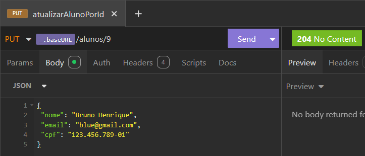
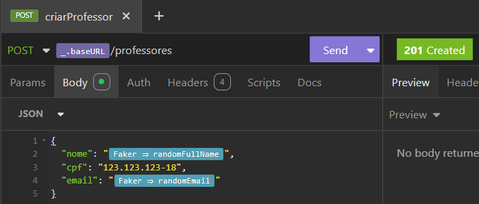
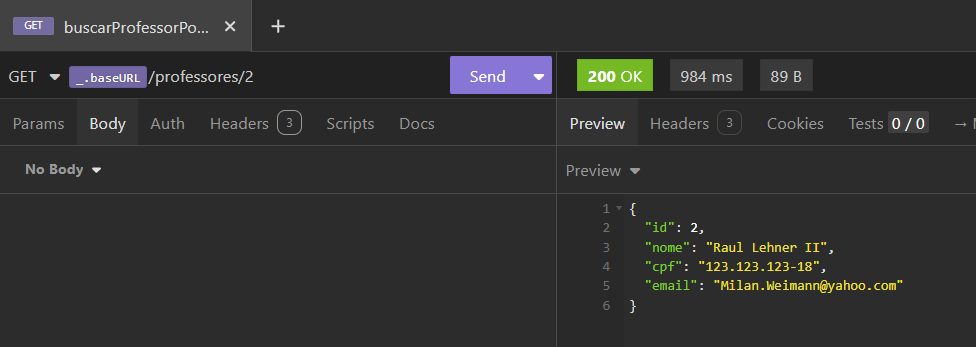
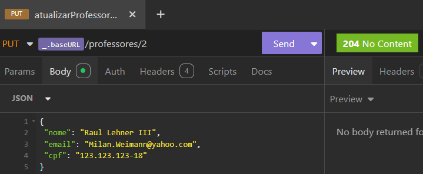
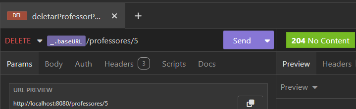
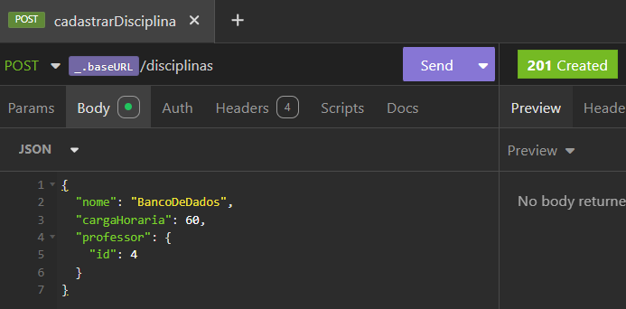
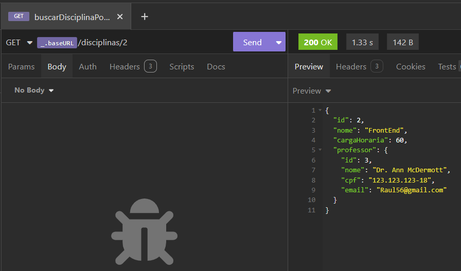
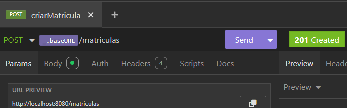
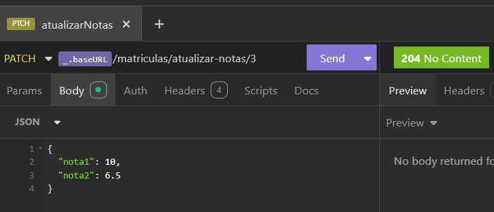

<h1 align="center">🎓 Aluno Online - Backend</h1>

  Sistema de gerenciamento acadêmico desenvolvido com Java e Spring Boot.

---

## 📖 Sumário

- [📚 Sobre](#-sobre)
- [🚀 Tecnologias e Ferramentas utilizadas](#-tecnologias-e-ferramentas-utilizadas)
- [🖼️ Prints](#-prints)
- [📘 Documentação Swagger](#-documentação-swagger)

---

## 📚 Sobre

Olá! Me chamo **Manuela Aimê**, sou estudante de **Sistemas de Informação** e atualmente curso o **3º período**.

Este repositório faz parte do meu desenvolvimento na disciplina **Tecnologia para Back-end I**, ministrada pelo professor **Kelson Almeida**.  
O projeto tem como objetivo aplicar os conceitos de **APIs RESTful** para construir um sistema completo de gerenciamento acadêmico, com foco em:

- Cadastro e manutenção de **Alunos**
- Cadastro e manutenção de **Professores**
- Cadastro de **Disciplinas**
- Realização de **Matrículas**

---

### ✅ Pré-requisitos

- Java 17
- PostgreSQL
- Maven

--- 
## 🚀 Tecnologias e Ferramentas utilizadas

---

## 🖼️ Prints

### 📬 Insomnia: Endpoints

> Testes realizados via Insomnia para simular requisições REST aos seguintes recursos:

- CRUD Aluno

---
- CRUD Professor

---
- CRUD Disciplina

---

- CRUD Matrícula de Aluno

---

### 🗃️ DBeaver: Estrutura do Banco

> Visualização das tabelas e relacionamentos no banco de dados PostgreSQL:

- Tabela `aluno`

- Tabela `professor`

- Tabela `disciplina`

- Tabela `matricula_aluno`

---

### 📄 Documentação Swagger

> A API conta com uma interface de documentação interativa através do Swagger.

---

## 🚀 Considerações Finais

Este projeto foi essencial para consolidar os meus conhecimentos em **desenvolvimento de APIs**, **boas práticas REST**, além da integração entre **banco de dados relacional**, **documentação** e **testes de API**.  
Sigo motivada para evoluir no ecossistema Java e no desenvolvimento back-end.

