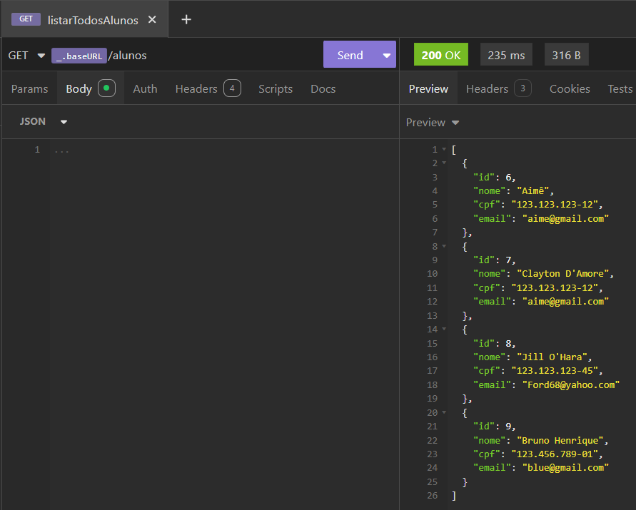
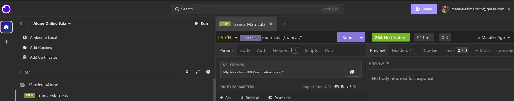
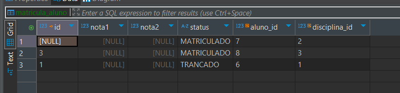

___
<h1 align="center">Aluno Online - Backend</h1> 

## 📖 Sumário

- [Sobre](#-sobre)
- [Tecnologias e Frameworks](#-tecnologias-e-frameworks)
- [Prints](#-insomnia)
    - Insomnia: 
    - CRUD ALUNO, 
     CRUD PROFESSOR, 
     CRUD DISCIPLINA, 
     CRUD MATRICULAALUNO](#insomnia-criar-aluno-operações-com-aluno)
    - [Dbeaver: 
    TABELAS ALUNO, 
    PROFESSOR, 
    DISCIPLINA 
    MATRICULALUNO]
    - [Swagger: DOCUMENTAÇÃO](#atividade-3-crud-aluno-crud-professor-crud-disciplina)

---

## 📚 Sobre

-Me chamo **Manuela Aimê**, sou uma estudante de Sistemas de Informação, no 3° Período.  
-Este projeto faz parte do meu processo de crescimento na disciplina de Tecnologia para Back-end I, ministrada pelo professor Kelson Almeida.  
O objetivo deste sistema é gerenciar o cadastro de Alunos, Professores e Disciplinas, consolidando práticas RestFul em desenvolvimento de APIs.

---

## 🛠️ Recursos / Frameworks

---

Este projeto tem como objetivo o desenvolvimento de uma aplicação completa utilizando API REST, voltada para a avaliação da disciplina de Tecnologia para Backend. O sistema foi projetado para gerenciar informações acadêmicas de forma eficiente.

 Tecnologias utilizadas:

Captura de tela mostrando o Banco de Dados conectado

Captura de tela mostrando a requisição criarAluno funcionando

Captura de tela mostrando a requisição listarTodosAlunos funcionando 

Captura de tela mostrando a requisição buscarAlunoPorId funcionando

Captura de tela mostrando o banco funcionando

Captura de tela mostrando a requisição deletarAlunoPorId funcionando 

Captura de tela mostrando o aluno deletado 

Captura de tela mostrando a requisição listarTodosProfesores funcionando 

Captura de tela mostrando a tabela Professor funcionando 

Captura de tela mostrando a requisição listarTodasDisciplinas funcionando 

Captura de tela mostrando a tabela Disciplina funcionando

Captura de tela mostrando a Documentação no Swagger 

Captura de tela mostrando a requisição trancarMatricula funcionando

Captura de tela mostrando trancarMatricula no Banco de Dados

