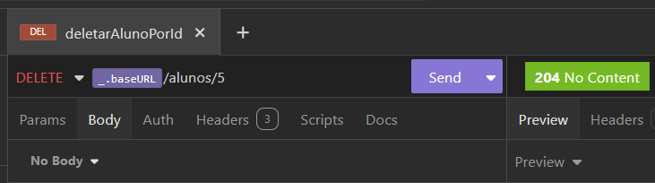
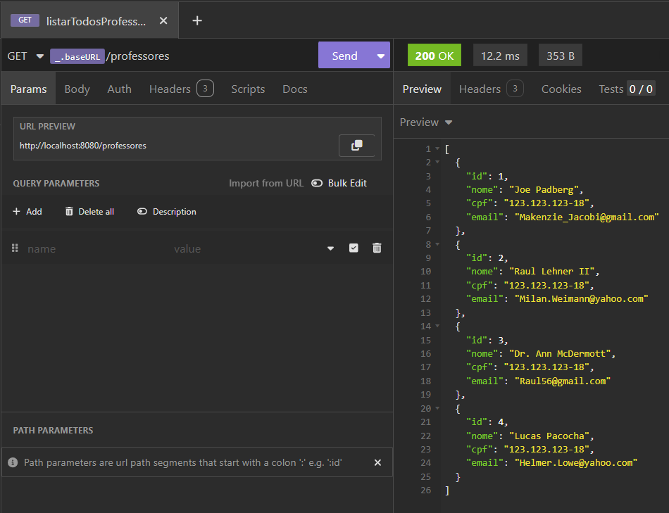
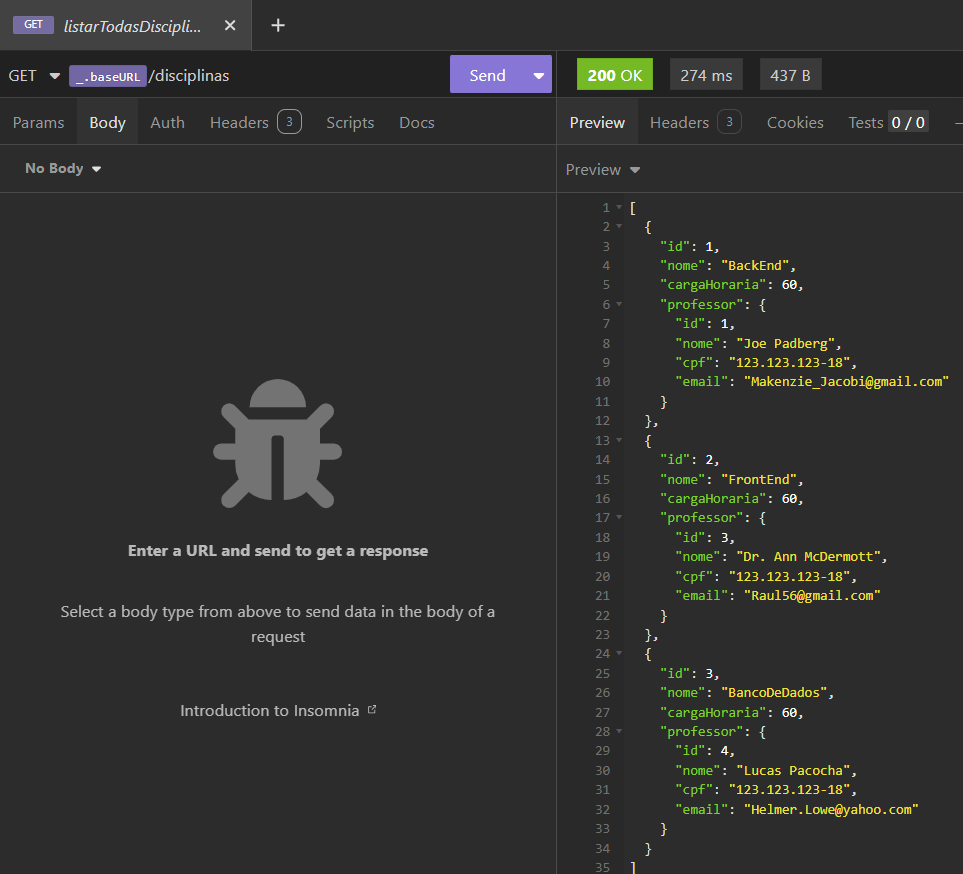

# Aluno Online - Backend

Este projeto tem como objetivo o desenvolvimento de uma aplicação completa utilizando API REST, voltada para a avaliação da disciplina de Tecnologia para Backend. O sistema foi projetado para gerenciar informações acadêmicas de forma eficiente.

 Tecnologias utilizadas:

Captura de tela mostrando o Banco de Dados conectado

Captura de tela mostrando a requisição criarAluno funcionando

Captura de tela mostrando a requisição listarTodosAlunos funcionando 

Captura de tela mostrando a requisição buscarAlunoPorId funcionando

Captura de tela mostrando o banco funcionando

Captura de tela mostrando a requisição deletarAlunoPorId funcionando 

Captura de tela mostrando o aluno deletado 

Captura de tela mostrando a requisição listarTodosProfesores funcionando 

Captura de tela mostrando a tabela Professor funcionando 

Captura de tela mostrando a requisição listarTodasDisciplinas funcionando 

Captura de tela mostrando a tabela Disciplina funcionando

